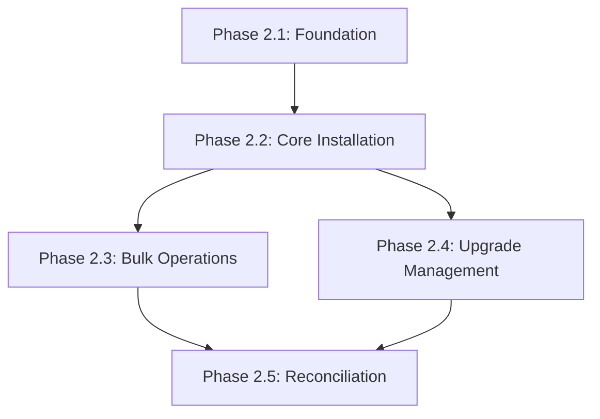

# Phase 2 Implementation Roadmap

**Version:** 1.0
**Status:** Planning
**Last Updated:** 2025-10-09
**Target Completion:** 8 weeks

## Document Overview

This document provides a detailed implementation roadmap for Phase 2: Installation and Upgrade Management of the AI CLI Preparation tool. It translates the requirements from [PRD.md](PRD.md) and architectural decisions from [ADR-001](adr/ADR-001-context-aware-installation.md) through [ADR-006](adr/ADR-006-configuration-file-format.md) into actionable development phases with specific deliverables, testing strategies, and success criteria.

**Target Audience:** Developers implementing Phase 2 features

**Prerequisites:**
- Phase 1 complete (detection and auditing capabilities)
- Familiarity with PRD requirements and ADR decisions
- Python 3.10+ development environment

---

## Phase 2 Objectives

Transform AI CLI Preparation from a **read-only auditing tool** into a **full lifecycle management system** capable of:

1. **Automated Installation**: Install missing tools with context-aware strategies
2. **Intelligent Upgrades**: Update outdated tools with breaking change awareness
3. **Conflict Resolution**: Reconcile multiple installations via PATH management
4. **Configuration Management**: User-controlled behavior via .cli-audit.yml
5. **Rollback Capability**: Snapshot-based restoration for failed upgrades

**Key Metrics:**
- Installation success rate: >90% first-attempt
- Time to readiness: <10 minutes for fresh system
- Breaking change detection: >90% accuracy for major versions
- Configuration validation: 100% error detection

---

## Implementation Phases

### Phase 2.1: Foundation (Weeks 1-2, 8-10 days)

**Goal:** Establish core infrastructure for context-aware installations without executing actual installations

#### Deliverables

##### 1. Environment Detection Logic

**Files:**
- `cli_audit/environment.py` (new)
- `tests/test_environment.py` (new)

**Implementation:**

```python
# cli_audit/environment.py

import os
import subprocess
from typing import Literal

EnvironmentMode = Literal['workstation', 'server', 'ci']

def detect_environment() -> EnvironmentMode:
    """
    Detect environment type using tiered priority detection.

    Returns:
        'ci' if CI environment detected
        'server' if shared server detected (3+ active users)
        'workstation' as safe default
    """
    # Priority 1: CI Detection (highest confidence)
    if is_ci_environment():
        return 'ci'

    # Priority 2: Server Detection (medium confidence)
    if is_shared_server():
        return 'server'

    # Priority 3: Workstation (conservative default)
    return 'workstation'


def is_ci_environment() -> bool:
    """Detect CI/CD environment from standard environment variables."""
    ci_vars = [
        'CI', 'CONTINUOUS_INTEGRATION',
        'GITHUB_ACTIONS', 'GITLAB_CI', 'JENKINS_HOME', 'JENKINS_URL',
        'CIRCLECI', 'TRAVIS', 'BUILDKITE', 'DRONE',
        'BITBUCKET_BUILD_NUMBER', 'TEAMCITY_VERSION', 'TF_BUILD',
    ]
    return any(var in os.environ for var in ci_vars)


def is_shared_server() -> bool:
    """
    Detect shared development server via active user count.

    Threshold: 3+ active users indicates shared server
    Rationale: 1-2 users = individual or pair programming
               3+ users = shared environment
    """
    try:
        active_users = get_active_users()
        return len(active_users) >= 3
    except Exception:
        return False  # Conservative: default to workstation


def get_active_users() -> list[dict]:
    """Get list of currently logged-in users."""
    try:
        output = subprocess.check_output(['who'], text=True, timeout=1)
        users = []

        for line in output.strip().split('\n'):
            if line:
                parts = line.split()
                if len(parts) >= 2:
                    users.append({
                        'name': parts[0],
                        'terminal': parts[1],
                        'login_time': ' '.join(parts[2:5]) if len(parts) >= 5 else '',
                    })

        # Deduplicate by username (same user may have multiple sessions)
        unique_users = {user['name']: user for user in users}
        return list(unique_users.values())

    except Exception:
        return []  # Fallback: cannot determine, assume single-user
```

##### 2. Configuration File Parsing

**Files:**
- `cli_audit/config.py` (new)
- `tests/test_config.py` (new)
- `cli_audit/schemas/config_schema.json` (new)

**Implementation:**

```python
# cli_audit/config.py

import os
import yaml
from pathlib import Path
from typing import Optional
from dataclasses import dataclass, field
from jsonschema import validate, ValidationError


@dataclass
class EnvironmentConfig:
    mode: str = 'auto'  # auto | workstation | server | ci


@dataclass
class PreferencesConfig:
    reconciliation: str = 'parallel'  # parallel | aggressive
    breaking_changes: str = 'warn'    # accept | warn | reject
    auto_upgrade: bool = True
    timeout_seconds: int = 5
    max_workers: int = 16
    package_managers: dict[str, list[str]] = field(default_factory=lambda: {
        'python': ['uv', 'pipx', 'pip'],
        'rust': ['rustup', 'cargo', 'system'],
        'node': ['nvm', 'npm', 'system'],
    })


@dataclass
class ToolConfig:
    version: str = 'latest'
    method: Optional[str] = None
    fallback: Optional[str] = None
    auto_upgrade: Optional[bool] = None


@dataclass
class Config:
    version: int = 1
    environment: EnvironmentConfig = field(default_factory=EnvironmentConfig)
    preferences: PreferencesConfig = field(default_factory=PreferencesConfig)
    tools: dict[str, ToolConfig] = field(default_factory=dict)
    presets: dict[str, list[str]] = field(default_factory=dict)


def load_config() -> Config:
    """
    Load and merge configuration from multiple locations.

    Precedence: Project → User → System
    """
    # Config file locations in precedence order
    config_files = [
        '/etc/cli-audit/config.yml',           # System-global (lowest)
        os.path.expanduser('~/.config/cli-audit/config.yml'),  # User-global
        '.cli-audit.yml',                      # Project-local (highest)
    ]

    configs = []
    for path in config_files:
        if os.path.exists(path):
            try:
                with open(path, 'r') as f:
                    cfg = yaml.safe_load(f)
                    if cfg:
                        configs.append((path, cfg))
            except Exception as e:
                print(f"⚠️  Failed to load {path}: {e}")

    # Merge configurations
    merged = merge_configs([cfg for _, cfg in configs])

    # Validate schema
    validate_config(merged)

    return dict_to_config(merged)


def merge_configs(configs: list[dict]) -> dict:
    """Merge configurations with later configs overriding earlier ones."""
    merged = {
        'version': 1,
        'environment': {},
        'preferences': {},
        'tools': {},
        'presets': {},
    }

    for config in configs:
        if 'environment' in config:
            merged['environment'].update(config['environment'])

        if 'preferences' in config:
            merged['preferences'].update(config['preferences'])

        if 'tools' in config:
            merged['tools'].update(config['tools'])

        if 'presets' in config:
            merged['presets'].update(config['presets'])

    return merged


def validate_config(config: dict) -> None:
    """Validate configuration against JSON schema."""
    schema = load_config_schema()

    try:
        validate(instance=config, schema=schema)
    except ValidationError as e:
        raise ValueError(f"Invalid configuration: {e.message}\n  Location: {e.json_path}")


def load_config_schema() -> dict:
    """Load JSON schema for configuration validation."""
    schema_path = Path(__file__).parent / 'schemas' / 'config_schema.json'
    with open(schema_path, 'r') as f:
        return json.load(f)


def dict_to_config(data: dict) -> Config:
    """Convert dictionary to Config dataclass."""
    # Implementation: construct Config from dictionary
    # (full implementation omitted for brevity)
    pass
```

##### 3. Package Manager Selection

**Files:**
- `cli_audit/package_managers.py` (new)
- `tests/test_package_managers.py` (new)

**Implementation:**

```python
# cli_audit/package_managers.py

import shutil
from typing import Optional

# Package manager hierarchy per category
PACKAGE_MANAGER_HIERARCHY = {
    'python': ['uv', 'pipx', 'pip'],
    'rust': ['rustup', 'cargo', 'system'],
    'node': ['nvm', 'npm', 'system'],
    'go': ['official', 'system'],
    'standalone': ['github', 'system'],
}


def select_package_manager(tool: Tool, config: Config) -> str:
    """
    Choose best available package manager for tool.

    Selection order:
    1. Config override (tool-specific method)
    2. Hierarchy (vendor tools → GitHub → system)
    3. Fallback (system package manager)
    """
    # 1. Check for config override
    if tool.name in config.tools and config.tools[tool.name].method:
        return config.tools[tool.name].method

    # 2. Follow hierarchy
    category = tool.category
    hierarchy = config.preferences.package_managers.get(
        category,
        PACKAGE_MANAGER_HIERARCHY.get(category, ['system'])
    )

    for method in hierarchy:
        if method == 'system':
            return detect_system_package_manager()
        if method == 'github' and tool.has_github_release:
            return 'github'
        if is_available(method):
            return method

    # 3. Fallback to system package manager
    return detect_system_package_manager()


def is_available(tool: str) -> bool:
    """Check if package manager is available on PATH."""
    return shutil.which(tool) is not None


def detect_system_package_manager() -> str:
    """Detect system package manager based on platform."""
    if is_available('apt'):
        return 'apt'
    elif is_available('brew'):
        return 'brew'
    elif is_available('dnf'):
        return 'dnf'
    elif is_available('pacman'):
        return 'pacman'
    else:
        return 'unknown'
```

##### 4. Dry-Run Mode

**Files:**
- `cli_audit/dry_run.py` (new)
- `cli_audit/install_plan.py` (new)

**Implementation:**

```python
# cli_audit/install_plan.py

from dataclasses import dataclass
from typing import List


@dataclass
class InstallStep:
    """Single installation step."""
    description: str
    command: str
    tool: str
    method: str
    estimated_time: int  # seconds


@dataclass
class InstallPlan:
    """Complete installation plan."""
    steps: List[InstallStep]
    estimated_time: int  # total seconds
    environment: str

    def to_script(self) -> str:
        """Generate bash script from plan."""
        lines = [
            '#!/bin/bash',
            '# Generated by cli_audit dry-run mode',
            f'# Environment: {self.environment}',
            f'# Estimated time: {self.estimated_time}s',
            '',
            'set -e  # Exit on error',
            '',
        ]

        for i, step in enumerate(self.steps, 1):
            lines.append(f'# Step {i}: {step.description}')
            lines.append(f'echo "[{i}/{len(self.steps)}] {step.description}..."')
            lines.append(step.command)
            lines.append('')

        lines.append('echo "✓ Installation complete"')
        return '\n'.join(lines)


def generate_install_plan(tools: list[Tool], config: Config) -> InstallPlan:
    """Generate installation plan without executing."""
    steps = []
    total_time = 0

    for tool in tools:
        method = select_package_manager(tool, config)
        command = generate_install_command(tool, method, config)
        estimated_time = estimate_install_time(tool, method)

        steps.append(InstallStep(
            description=f'Install {tool.name} via {method}',
            command=command,
            tool=tool.name,
            method=method,
            estimated_time=estimated_time,
        ))

        total_time += estimated_time

    return InstallPlan(
        steps=steps,
        estimated_time=total_time,
        environment=config.environment.mode,
    )
```

#### Success Criteria

- [ ] Environment detection correctly identifies CI, server, workstation (>95% accuracy)
- [ ] Configuration parsing handles YAML syntax errors gracefully
- [ ] Schema validation catches all malformed configurations
- [ ] Package manager selection follows hierarchy correctly
- [ ] Dry-run generates valid bash scripts
- [ ] All functions have unit tests with >80% coverage

#### Testing Strategy

**Unit Tests:**
```python
def test_detect_ci_environment(monkeypatch):
    monkeypatch.setenv('GITHUB_ACTIONS', 'true')
    assert detect_environment() == 'ci'

def test_detect_server_environment(monkeypatch):
    monkeypatch.setattr('cli_audit.environment.get_active_users',
                        lambda: [{'name': f'user{i}'} for i in range(4)])
    assert detect_environment() == 'server'

def test_config_validation_rejects_invalid_mode():
    config = {'version': 1, 'environment': {'mode': 'invalid'}}
    with pytest.raises(ValueError):
        validate_config(config)
```

**Integration Tests:**
- Test configuration loading from multiple locations
- Verify precedence (project overrides user overrides system)
- Test environment detection on actual systems

#### Estimated Timeline

**Week 1:**
- Days 1-2: Environment detection logic + tests
- Days 3-4: Configuration file parsing + schema validation
- Day 5: Integration testing

**Week 2:**
- Days 1-2: Package manager selection + hierarchy
- Days 3-4: Dry-run mode + install plan generation
- Day 5: Documentation and code review

---

### Phase 2.2: Core Installation (Weeks 3-4, 10-12 days)

**Goal:** Implement actual installation execution for single tools with verification

#### Deliverables

##### 1. Installation Execution Engine

**Files:**
- `cli_audit/install.py` (new)
- `cli_audit/installers/` (new directory)
  - `base.py` (abstract base class)
  - `python.py` (uv, pipx, pip installers)
  - `rust.py` (rustup, cargo installers)
  - `node.py` (nvm, npm installers)
  - `github.py` (GitHub release installer)
  - `system.py` (apt, brew installers)

**Implementation:**

```python
# cli_audit/installers/base.py

from abc import ABC, abstractmethod
from dataclasses import dataclass
from typing import Optional


@dataclass
class InstallResult:
    """Result of installation attempt."""
    success: bool
    tool: str
    version: str
    method: str
    path: Optional[str] = None
    error: Optional[str] = None
    duration: float = 0.0  # seconds


class BaseInstaller(ABC):
    """Abstract base class for tool installers."""

    def __init__(self, config: Config):
        self.config = config

    @abstractmethod
    def install(self, tool: Tool, version: str = 'latest') -> InstallResult:
        """Install tool with specified version."""
        pass

    @abstractmethod
    def is_available(self) -> bool:
        """Check if this installer is available on system."""
        pass

    def verify_installation(self, tool: Tool) -> bool:
        """Verify tool is accessible and correct version."""
        try:
            # Check tool is on PATH
            path = shutil.which(tool.candidates[0])
            if not path:
                return False

            # Verify version
            detected = get_version(path)
            return detected is not None
        except Exception:
            return False


# cli_audit/installers/python.py

class UvInstaller(BaseInstaller):
    """Installer using uv tool manager."""

    def is_available(self) -> bool:
        return shutil.which('uv') is not None

    def install(self, tool: Tool, version: str = 'latest') -> InstallResult:
        """Install Python tool via uv."""
        start = time.time()

        try:
            # Build command
            cmd = ['uv', 'tool', 'install', tool.name]
            if version != 'latest':
                cmd.append(f'{tool.name}=={version}')

            # Execute with retry logic
            result = execute_with_retry(cmd, max_attempts=3)

            if result.returncode != 0:
                return InstallResult(
                    success=False,
                    tool=tool.name,
                    version=version,
                    method='uv',
                    error=result.stderr,
                    duration=time.time() - start,
                )

            # Verify installation
            if not self.verify_installation(tool):
                return InstallResult(
                    success=False,
                    tool=tool.name,
                    version=version,
                    method='uv',
                    error='Installation succeeded but tool not accessible',
                    duration=time.time() - start,
                )

            # Get installed version and path
            installed_version = get_version(shutil.which(tool.candidates[0]))

            return InstallResult(
                success=True,
                tool=tool.name,
                version=installed_version,
                method='uv',
                path=shutil.which(tool.candidates[0]),
                duration=time.time() - start,
            )

        except Exception as e:
            return InstallResult(
                success=False,
                tool=tool.name,
                version=version,
                method='uv',
                error=str(e),
                duration=time.time() - start,
            )


# cli_audit/installers/github.py

class GitHubInstaller(BaseInstaller):
    """Installer for GitHub release binaries."""

    def install(self, tool: Tool, version: str = 'latest') -> InstallResult:
        """Download and install binary from GitHub release."""
        start = time.time()

        try:
            # Resolve version
            if version == 'latest':
                version = get_latest_github_release(tool.github_repo)

            # Build download URL
            asset_name = get_asset_name(tool, version, platform.system(), platform.machine())
            download_url = f'https://github.com/{tool.github_repo}/releases/download/{version}/{asset_name}'

            # Download with progress
            temp_file = download_with_progress(download_url, tool.name)

            # Verify checksum if available
            if tool.has_checksums:
                checksum_url = f'{download_url}.sha256'
                expected_checksum = download_checksum(checksum_url)
                actual_checksum = compute_sha256(temp_file)

                if expected_checksum != actual_checksum:
                    return InstallResult(
                        success=False,
                        tool=tool.name,
                        version=version,
                        method='github',
                        error=f'Checksum mismatch: expected {expected_checksum}, got {actual_checksum}',
                        duration=time.time() - start,
                    )

            # Extract and install
            extract_path = extract_archive(temp_file)
            binary_path = find_binary_in_extract(extract_path, tool.candidates[0])

            # Determine install location
            install_dir = get_install_directory(self.config.environment.mode)
            target_path = os.path.join(install_dir, tool.candidates[0])

            # Move binary to install location
            shutil.move(binary_path, target_path)
            os.chmod(target_path, 0o755)

            # Cleanup
            shutil.rmtree(extract_path)
            os.remove(temp_file)

            # Verify
            if not self.verify_installation(tool):
                return InstallResult(
                    success=False,
                    tool=tool.name,
                    version=version,
                    method='github',
                    error='Binary installed but not accessible (PATH issue?)',
                    duration=time.time() - start,
                )

            return InstallResult(
                success=True,
                tool=tool.name,
                version=version,
                method='github',
                path=target_path,
                duration=time.time() - start,
            )

        except Exception as e:
            return InstallResult(
                success=False,
                tool=tool.name,
                version=version,
                method='github',
                error=str(e),
                duration=time.time() - start,
            )
```

##### 2. Retry Logic and Error Handling

**Files:**
- `cli_audit/retry.py` (new)

**Implementation:**

```python
# cli_audit/retry.py

import time
import subprocess
from typing import Callable


def execute_with_retry(
    cmd: list[str],
    max_attempts: int = 3,
    backoff_factor: float = 2.0,
    timeout: int = 300,
) -> subprocess.CompletedProcess:
    """
    Execute command with exponential backoff retry.

    Args:
        cmd: Command to execute
        max_attempts: Maximum retry attempts
        backoff_factor: Exponential backoff multiplier
        timeout: Command timeout in seconds

    Returns:
        CompletedProcess result

    Raises:
        subprocess.TimeoutExpired: If all attempts timeout
        subprocess.CalledProcessError: If all attempts fail
    """
    attempt = 0
    last_error = None

    while attempt < max_attempts:
        try:
            result = subprocess.run(
                cmd,
                capture_output=True,
                text=True,
                timeout=timeout,
                check=False,
            )

            # Success
            if result.returncode == 0:
                return result

            # Transient error (network, rate limit)
            if is_transient_error(result.stderr):
                attempt += 1
                if attempt < max_attempts:
                    delay = backoff_factor ** attempt
                    print(f"⚠️  Attempt {attempt} failed, retrying in {delay}s...")
                    time.sleep(delay)
                    continue

            # Permanent error (permission, not found)
            return result

        except subprocess.TimeoutExpired as e:
            last_error = e
            attempt += 1
            if attempt < max_attempts:
                print(f"⚠️  Command timeout, retrying...")
                continue

    # All attempts exhausted
    if last_error:
        raise last_error
    else:
        raise subprocess.CalledProcessError(result.returncode, cmd, result.stdout, result.stderr)


def is_transient_error(stderr: str) -> bool:
    """Detect transient errors that warrant retry."""
    transient_patterns = [
        'connection refused',
        'connection timeout',
        'network unreachable',
        'temporary failure',
        'rate limit',
        'too many requests',
    ]

    stderr_lower = stderr.lower()
    return any(pattern in stderr_lower for pattern in transient_patterns)
```

##### 3. Checksum Verification

**Files:**
- `cli_audit/checksum.py` (new)

**Implementation:**

```python
# cli_audit/checksum.py

import hashlib


def compute_sha256(file_path: str) -> str:
    """Compute SHA256 checksum of file."""
    sha256 = hashlib.sha256()

    with open(file_path, 'rb') as f:
        for chunk in iter(lambda: f.read(4096), b''):
            sha256.update(chunk)

    return sha256.hexdigest()


def verify_checksum(file_path: str, expected: str, algorithm: str = 'sha256') -> bool:
    """Verify file checksum matches expected value."""
    if algorithm == 'sha256':
        actual = compute_sha256(file_path)
    else:
        raise ValueError(f'Unsupported algorithm: {algorithm}')

    return actual.lower() == expected.lower()
```

#### Success Criteria

- [ ] Single tool installation succeeds >90% on first attempt
- [ ] Checksum verification prevents corrupted installs
- [ ] Retry logic handles transient network failures
- [ ] Post-install validation detects installation failures
- [ ] Error messages provide actionable resolution guidance
- [ ] Installation time <30s per tool (excluding download)

#### Testing Strategy

**Unit Tests:**
```python
def test_uv_installer_success(monkeypatch):
    monkeypatch.setattr('subprocess.run', mock_successful_uv_install)
    installer = UvInstaller(config)
    result = installer.install(black_tool)
    assert result.success
    assert result.method == 'uv'

def test_github_installer_checksum_failure():
    installer = GitHubInstaller(config)
    with mock_checksum_mismatch():
        result = installer.install(ripgrep_tool)
        assert not result.success
        assert 'checksum mismatch' in result.error.lower()
```

**Integration Tests:**
- Install tools via all package managers (uv, cargo, npm, GitHub)
- Test retry logic with simulated network failures
- Verify checksum validation with corrupted downloads

#### Estimated Timeline

**Week 3:**
- Days 1-2: Base installer architecture + Python installers (uv, pipx, pip)
- Days 3-4: Rust installers (rustup, cargo) + Node installers (nvm, npm)
- Day 5: Integration testing

**Week 4:**
- Days 1-2: GitHub release installer + checksum verification
- Days 3-4: System package manager installers (apt, brew)
- Day 5: End-to-end testing + documentation

---

### Phase 2.3: Bulk Operations (Week 5, 5-6 days)

**Goal:** Enable parallel installation of multiple tools with progress reporting

#### Deliverables

##### 1. Parallel Installation Coordinator

**Files:**
- `cli_audit/bulk.py` (new)
- `cli_audit/progress.py` (new)

**Implementation:**

```python
# cli_audit/bulk.py

from concurrent.futures import ThreadPoolExecutor, as_completed
from typing import List
import threading


@dataclass
class BulkResult:
    """Result of bulk installation."""
    success_count: int
    failure_count: int
    skipped_count: int
    results: List[InstallResult]
    duration: float


def install_missing(config: Config) -> BulkResult:
    """Install all missing tools."""
    # Audit to find missing tools
    audit_results = audit_tools(config)
    missing = [t for t in audit_results if t.status == 'NOT INSTALLED']

    print(f"Found {len(missing)} missing tools")
    return parallel_install(missing, config)


def install_preset(preset_name: str, config: Config) -> BulkResult:
    """Install tools from role preset."""
    if preset_name not in config.presets:
        # Try built-in presets
        preset = BUILTIN_PRESETS.get(preset_name)
        if not preset:
            raise ValueError(f'Unknown preset: {preset_name}')
    else:
        preset = config.presets[preset_name]

    tools = [get_tool_by_name(name) for name in preset]
    return parallel_install(tools, config)


def parallel_install(tools: List[Tool], config: Config) -> BulkResult:
    """
    Install multiple tools in parallel with coordination.

    Features:
    - Progress reporting (live updates)
    - Advisory locks (for server mode)
    - Atomic rollback on critical failures
    """
    start = time.time()
    results = []
    lock = threading.Lock()

    # Create progress tracker
    progress = ProgressTracker(total=len(tools))

    # Install in parallel
    max_workers = config.preferences.max_workers

    with ThreadPoolExecutor(max_workers=max_workers) as executor:
        # Submit all install tasks
        future_to_tool = {}
        for tool in tools:
            installer = get_installer(tool, config)
            future = executor.submit(install_with_progress, tool, installer, progress, lock)
            future_to_tool[future] = tool

        # Collect results as they complete
        for future in as_completed(future_to_tool):
            tool = future_to_tool[future]
            try:
                result = future.result()
                with lock:
                    results.append(result)
                    progress.update(tool.name, result.success)
            except Exception as e:
                with lock:
                    results.append(InstallResult(
                        success=False,
                        tool=tool.name,
                        version='unknown',
                        method='unknown',
                        error=str(e),
                    ))
                    progress.update(tool.name, False)

    # Summary
    duration = time.time() - start
    success_count = sum(1 for r in results if r.success)
    failure_count = sum(1 for r in results if not r.success)

    return BulkResult(
        success_count=success_count,
        failure_count=failure_count,
        skipped_count=0,
        results=results,
        duration=duration,
    )


def install_with_progress(
    tool: Tool,
    installer: BaseInstaller,
    progress: ProgressTracker,
    lock: threading.Lock,
) -> InstallResult:
    """Install single tool with progress updates."""
    with lock:
        progress.start(tool.name)

    result = installer.install(tool)

    with lock:
        progress.complete(tool.name, result.success)

    return result
```

##### 2. Progress Reporting

**Files:**
- `cli_audit/progress.py`

**Implementation:**

```python
# cli_audit/progress.py

import sys
from typing import Dict


class ProgressTracker:
    """Track and display installation progress."""

    def __init__(self, total: int):
        self.total = total
        self.completed = 0
        self.succeeded = 0
        self.failed = 0
        self.status: Dict[str, str] = {}  # tool -> status

    def start(self, tool: str):
        """Mark tool installation as started."""
        self.status[tool] = '🔄 installing'
        self._display()

    def complete(self, tool: str, success: bool):
        """Mark tool installation as complete."""
        self.completed += 1
        if success:
            self.succeeded += 1
            self.status[tool] = '✓ installed'
        else:
            self.failed += 1
            self.status[tool] = '✗ failed'
        self._display()

    def _display(self):
        """Display progress (live updating)."""
        # Clear line
        sys.stdout.write('\r' + ' ' * 80 + '\r')

        # Progress summary
        progress_pct = (self.completed / self.total * 100) if self.total > 0 else 0
        sys.stdout.write(
            f'[{self.completed}/{self.total}] {progress_pct:.0f}% '
            f'(✓ {self.succeeded} ✗ {self.failed})'
        )
        sys.stdout.flush()

        # Newline if complete
        if self.completed == self.total:
            sys.stdout.write('\n')
```

##### 3. Rollback on Failure

**Files:**
- `cli_audit/rollback.py` (new)

**Implementation:**

```python
# cli_audit/rollback.py

def create_snapshot() -> Snapshot:
    """Create snapshot of current tool state."""
    audit_results = audit_tools(Config())

    snapshot = {
        '__meta__': {
            'created_at': datetime.now().isoformat(),
            'purpose': 'pre-install-rollback',
            'count': len(audit_results),
        },
        'tools': []
    }

    for result in audit_results:
        if result.status == 'UP-TO-DATE' or result.status == 'OUTDATED':
            snapshot['tools'].append({
                'tool': result.tool,
                'version': result.installed,
                'method': result.method,
                'path': result.path,
            })

    snapshot_path = f'.cli-audit-snapshot-{int(time.time())}.json'
    with open(snapshot_path, 'w') as f:
        json.dump(snapshot, f, indent=2)

    print(f"✓ Snapshot created: {snapshot_path}")
    return snapshot


def rollback_install(snapshot_path: str) -> None:
    """Rollback to snapshot state (uninstall tools added since snapshot)."""
    with open(snapshot_path, 'r') as f:
        snapshot = json.load(f)

    snapshot_tools = {t['tool']: t for t in snapshot['tools']}
    current_results = audit_tools(Config())

    # Find tools to uninstall (present now, not in snapshot)
    to_uninstall = []
    for result in current_results:
        if result.tool not in snapshot_tools and result.status != 'NOT INSTALLED':
            to_uninstall.append(result)

    print(f"Rollback: Uninstalling {len(to_uninstall)} tools...")

    for result in to_uninstall:
        uninstaller = get_uninstaller(result.method)
        uninstaller.uninstall(result.tool)
        print(f"  ✓ Uninstalled {result.tool}")
```

#### Success Criteria

- [ ] Install 10+ tools in parallel without conflicts
- [ ] Progress reporting updates in real-time
- [ ] Rollback restores system to pre-install state
- [ ] Advisory locks prevent conflicts on servers (future)
- [ ] Bulk install completes in <5 minutes for 10 tools

#### Testing Strategy

**Unit Tests:**
```python
def test_parallel_install_success():
    tools = [ripgrep_tool, fd_tool, bat_tool]
    result = parallel_install(tools, config)
    assert result.success_count == 3
    assert result.failure_count == 0

def test_rollback_restores_state():
    snapshot = create_snapshot()
    install_missing(config)  # Install new tools
    rollback_install(snapshot)
    # Verify tools uninstalled
```

**Integration Tests:**
- Install 10+ tools in parallel
- Test progress reporting with real installations
- Verify rollback with mixed success/failure scenarios

#### Estimated Timeline

- Days 1-2: Parallel installation coordinator
- Days 3: Progress reporting and live updates
- Days 4-5: Rollback capability + testing

---

### Phase 2.4: Upgrade Management (Week 6, 5-6 days)

**Goal:** Implement tool upgrades with breaking change detection and rollback

#### Deliverables

##### 1. Upgrade Logic

**Files:**
- `cli_audit/upgrade.py` (new)

**Implementation:**

```python
# cli_audit/upgrade.py

def upgrade_tool(tool: Tool, config: Config, to_version: str = 'latest') -> InstallResult:
    """
    Upgrade tool to specified version with breaking change warnings.

    Steps:
    1. Get current version
    2. Resolve target version
    3. Detect breaking changes (major version bump)
    4. Warn user if breaking changes detected
    5. Execute upgrade
    6. Verify new version
    """
    # Get current version
    current_version = get_installed_version(tool)
    if not current_version:
        return InstallResult(
            success=False,
            tool=tool.name,
            version=to_version,
            method='unknown',
            error='Tool not currently installed',
        )

    # Resolve target version
    if to_version == 'latest':
        to_version = get_latest_version(tool)

    # Check if upgrade needed
    if compare_versions(current_version, to_version) >= 0:
        return InstallResult(
            success=True,
            tool=tool.name,
            version=current_version,
            method='none',
            error='Already at target version or newer',
        )

    # Detect breaking changes
    if is_major_upgrade(current_version, to_version):
        if not handle_breaking_change(tool, current_version, to_version, config):
            return InstallResult(
                success=False,
                tool=tool.name,
                version=to_version,
                method='skipped',
                error='User declined major upgrade',
            )

    # Create snapshot for rollback
    snapshot = create_snapshot()
    print(f"✓ Snapshot created: {snapshot}")

    # Execute upgrade
    installer = get_installer(tool, config)
    result = installer.install(tool, to_version)

    if not result.success:
        print(f"❌ Upgrade failed, rollback available: cli_audit rollback --from {snapshot}")

    return result


def is_major_upgrade(current: str, target: str) -> bool:
    """Check if upgrade crosses major version boundary."""
    try:
        curr_parts = current.split('.')
        target_parts = target.split('.')

        curr_major = int(curr_parts[0])
        target_major = int(target_parts[0])

        return target_major > curr_major
    except (ValueError, IndexError):
        return False  # Conservative: assume not major if parsing fails


def handle_breaking_change(tool: Tool, from_ver: str, to_ver: str, config: Config) -> bool:
    """
    Handle major version upgrade with user confirmation.

    Returns:
        True if upgrade should proceed, False otherwise
    """
    # Display warning
    print(f"\n⚠️  Major version upgrade detected:")
    print(f"    Tool: {tool.name}")
    print(f"    Current: {from_ver}")
    print(f"    Target: {to_ver}")
    print(f"\n    Potential breaking changes:")
    print(f"    - API changes")
    print(f"    - Flag deprecations")
    print(f"    - Output format changes")

    if tool.release_notes_url:
        print(f"\n    Review release notes: {tool.release_notes_url}")

    # Context-aware handling
    env_mode = config.environment.mode
    breaking_policy = config.preferences.breaking_changes

    if breaking_policy == 'accept':
        return True
    elif breaking_policy == 'reject':
        return False
    else:  # warn
        if env_mode == 'workstation':
            default = True
            return confirm("Proceed with upgrade? [Y/n]: ", default=default)
        elif env_mode == 'server':
            default = False
            return confirm("Proceed with upgrade? [y/N]: ", default=default)
        elif env_mode == 'ci':
            print("    CI mode: major upgrades disabled")
            return False

    return False
```

##### 2. Version Comparison

**Files:**
- `cli_audit/versions.py` (extend existing)

**Implementation:**

```python
# cli_audit/versions.py (additions)

from packaging import version as pkg_version


def compare_versions(v1: str, v2: str) -> int:
    """
    Compare versions using semantic versioning.

    Returns:
        -1 if v1 < v2
         0 if v1 == v2
         1 if v1 > v2
    """
    try:
        ver1 = pkg_version.parse(v1)
        ver2 = pkg_version.parse(v2)

        if ver1 < ver2:
            return -1
        elif ver1 > ver2:
            return 1
        else:
            return 0
    except Exception:
        # Fallback: string comparison
        if v1 < v2:
            return -1
        elif v1 > v2:
            return 1
        else:
            return 0


def parse_version_constraint(constraint: str, current: str) -> str:
    """
    Parse version constraint and return target version.

    Examples:
        "latest" → latest available
        "3.12.*" → latest 3.12.x
        ">=3.11" → latest >= 3.11
        "=3.11.5" → exactly 3.11.5
    """
    if constraint == 'latest':
        return 'latest'

    if constraint.startswith('='):
        return constraint[1:]

    if '*' in constraint:
        # Range: 3.12.* → find latest 3.12.x
        prefix = constraint.replace('*', '')
        return resolve_wildcard_version(prefix)

    if constraint.startswith('>=') or constraint.startswith('^') or constraint.startswith('~'):
        # Range: find latest within constraint
        return resolve_range_version(constraint)

    return constraint
```

#### Success Criteria

- [ ] Detects 90%+ major version upgrades correctly
- [ ] Breaking change warnings prevent surprises
- [ ] Rollback restores tool to previous version
- [ ] Upgrade preserves configuration files
- [ ] Context-aware confirmation (workstation vs server)

#### Testing Strategy

**Unit Tests:**
```python
def test_is_major_upgrade():
    assert is_major_upgrade('13.0.0', '14.0.0') == True
    assert is_major_upgrade('14.0.0', '14.1.0') == False
    assert is_major_upgrade('14.0.0', '14.0.1') == False

def test_version_constraint_parsing():
    assert parse_version_constraint('latest', '3.11') == 'latest'
    assert parse_version_constraint('=3.12.0', '3.11') == '3.12.0'
```

**Integration Tests:**
- Upgrade tools across major version boundaries
- Test rollback after failed upgrades
- Verify breaking change detection with real tools

#### Estimated Timeline

- Days 1-2: Upgrade logic + breaking change detection
- Days 3: Version constraint parsing
- Days 4-5: Testing + rollback integration

---

### Phase 2.5: Reconciliation (Week 7-8, 6-8 days)

**Goal:** Detect and reconcile multiple installations of same tool

#### Deliverables

##### 1. Installation Detection

**Files:**
- `cli_audit/reconcile.py` (new)

**Implementation:**

```python
# cli_audit/reconcile.py

@dataclass
class Installation:
    """Single installation of a tool."""
    tool: str
    version: str
    method: str
    path: str
    active: bool  # Is this the version on PATH?


def detect_installations(tool: Tool) -> List[Installation]:
    """Find all installations of a tool across PATH."""
    installations = []
    seen_paths = set()

    # Search all PATH directories
    for path_dir in os.environ['PATH'].split(':'):
        for candidate in tool.candidates:
            full_path = os.path.join(path_dir, candidate)

            if full_path in seen_paths:
                continue

            if os.path.exists(full_path) and os.access(full_path, os.X_OK):
                seen_paths.add(full_path)

                version = get_version(full_path)
                method = classify_install_method(full_path)
                active = (full_path == shutil.which(candidate))

                installations.append(Installation(
                    tool=tool.name,
                    version=version,
                    method=method,
                    path=full_path,
                    active=active,
                ))

    return installations


def classify_install_method(path: str) -> str:
    """Classify installation method from path."""
    if '/.cargo/bin' in path:
        return 'cargo'
    elif '/.local/bin' in path:
        return 'pipx'
    elif '/.uv/bin' in path or '/uv-python' in path:
        return 'uv'
    elif '/.nvm/' in path:
        return 'nvm'
    elif '/usr/local/bin' in path:
        return 'brew'
    elif '/usr/bin' in path:
        return 'apt'
    else:
        return 'unknown'
```

##### 2. Parallel Reconciliation (Default)

**Implementation:**

```python
def reconcile_parallel(tool: Tool, installations: List[Installation], config: Config) -> None:
    """
    Parallel reconciliation: keep all installations, prefer user-level via PATH.

    Strategy:
    - Keep all installations (no removal)
    - Verify PATH ordering ensures preferred version is active
    - Provide guidance for manual cleanup if desired
    """
    if len(installations) <= 1:
        print(f"✓ {tool.name}: Single installation, no reconciliation needed")
        return

    print(f"\nReconciling {tool.name} installations:\n")
    print(f"Found {len(installations)} installations:")

    # Sort by preference (user > system)
    sorted_installs = sort_by_preference(installations, config)

    for i, inst in enumerate(sorted_installs, 1):
        active = "[ACTIVE]" if inst.active else ""
        preferred = "[PREFERRED]" if i == 1 else ""
        print(f"  [{i}] {inst.version} ({inst.method}, {inst.path}) {active} {preferred}")

    print(f"\nStrategy: parallel (keep both)")
    print(f"\nActions:")

    # Verify preferred is active
    preferred = sorted_installs[0]
    if preferred.active:
        print(f"  ✓ PATH ordering ensures [{1}] is active")
    else:
        print(f"  ⚠️  PATH ordering issue: [{1}] should be active but isn't")
        print(f"     Active: {[i for i, inst in enumerate(sorted_installs, 1) if inst.active]}")
        print(f"     Fix: Ensure {os.path.dirname(preferred.path)} appears first in PATH")

    if len(installations) > 1:
        print(f"  ℹ️  Other installations remain available")
        print(f"  💡 Run 'cli_audit reconcile --aggressive {tool.name}' to remove non-preferred")

    # PATH verification
    print(f"\nCurrent PATH:")
    path_dirs = os.environ['PATH'].split(':')
    for path_dir in path_dirs[:5]:  # Show first 5
        if any(inst.path.startswith(path_dir) for inst in installations):
            marker = "←" if path_dir == os.path.dirname(preferred.path) else ""
            print(f"  {path_dir} {marker}")

    print(f"  ↑ {preferred.path} will be used")
```

##### 3. Aggressive Reconciliation (Optional)

**Implementation:**

```python
def reconcile_aggressive(tool: Tool, installations: List[Installation], config: Config) -> None:
    """
    Aggressive reconciliation: remove non-preferred installations.

    Strategy:
    - Keep only preferred installation
    - Remove all others (requires confirmation)
    - May require sudo for system packages
    """
    if len(installations) <= 1:
        print(f"✓ {tool.name}: Single installation, no reconciliation needed")
        return

    sorted_installs = sort_by_preference(installations, config)
    preferred = sorted_installs[0]
    others = sorted_installs[1:]

    print(f"\n⚠️  WARNING: Aggressive reconciliation will remove {len(others)} installation(s)\n")

    for inst in others:
        print(f"  - {inst.version} ({inst.method}, {inst.path})")

    print(f"\nKeeping: {preferred.version} ({preferred.method}, {preferred.path})")

    if not confirm("Proceed with removal? [y/N]: ", default=False):
        print("Aborted.")
        return

    # Remove each non-preferred installation
    for inst in others:
        try:
            uninstaller = get_uninstaller(inst.method)
            uninstaller.uninstall(tool.name)
            print(f"  ✓ Removed {inst.path}")
        except PermissionError:
            print(f"  ❌ Cannot remove {inst.path}: requires sudo")
            print(f"     Run: sudo apt remove {tool.name}  # or brew uninstall")
        except Exception as e:
            print(f"  ❌ Failed to remove {inst.path}: {e}")

    print(f"\n✓ Reconciliation complete")
```

##### 4. PATH Management

**Implementation:**

```python
def verify_path_ordering(config: Config) -> List[str]:
    """
    Verify PATH ordering ensures user bins appear before system bins.

    Returns:
        List of issues found
    """
    issues = []

    user_bins = [
        os.path.expanduser('~/.local/bin'),
        os.path.expanduser('~/.cargo/bin'),
        os.path.expanduser('~/.uv/bin'),
    ]

    system_bins = ['/usr/local/bin', '/usr/bin', '/bin']

    path_dirs = os.environ['PATH'].split(':')

    for user_bin in user_bins:
        if user_bin not in path_dirs:
            continue

        user_idx = path_dirs.index(user_bin)

        for sys_bin in system_bins:
            if sys_bin not in path_dirs:
                continue

            sys_idx = path_dirs.index(sys_bin)

            if user_idx > sys_idx:
                # BAD: system bin before user bin
                issues.append(
                    f"PATH ordering issue: {sys_bin} appears before {user_bin}\n"
                    f"  Fix: Add to ~/.bashrc or ~/.zshrc:\n"
                    f"    export PATH=\"{user_bin}:$PATH\""
                )

    return issues
```

#### Success Criteria

- [ ] Correctly identifies all tool installations
- [ ] PATH ordering ensures preferred version is active
- [ ] Aggressive mode safely removes non-preferred versions
- [ ] Conflict resolution prevents broken installations
- [ ] Reconciliation completes in <5s per tool

#### Testing Strategy

**Unit Tests:**
```python
def test_detect_installations():
    installs = detect_installations(ripgrep_tool)
    assert len(installs) >= 1
    assert any(i.active for i in installs)

def test_classify_install_method():
    assert classify_install_method('/home/user/.cargo/bin/rg') == 'cargo'
    assert classify_install_method('/usr/bin/rg') == 'apt'
```

**Integration Tests:**
- Install same tool via multiple methods
- Verify reconciliation detects all installations
- Test aggressive reconciliation with removal

#### Estimated Timeline

**Week 7:**
- Days 1-2: Installation detection + classification
- Days 3-4: Parallel reconciliation logic
- Day 5: PATH management and verification

**Week 8:**
- Days 1-2: Aggressive reconciliation + removal
- Days 3: Testing and bug fixes
- Days 4-5: Documentation + code review

---

## Dependencies Between Phases



**Critical Path:**
1. Foundation must complete before any installation work
2. Core installation must work before bulk operations
3. Reconciliation depends on both bulk and upgrade features

**Parallel Opportunities:**
- Phases 2.3 and 2.4 can be developed in parallel (different features)
- Testing can happen concurrently with development

---

## Risk Mitigation Strategies

### High-Risk Areas

#### 1. Installation Failures (Impact: High, Probability: Medium)

**Risks:**
- Network failures during download
- Permission errors (no sudo access)
- Corrupted downloads
- Package manager unavailable

**Mitigation:**
- Retry logic with exponential backoff (3 attempts)
- Clear error messages with resolution guidance
- Checksum verification for all downloads
- Fallback package managers (hierarchy)
- Pre-flight checks (permissions, disk space, network)

#### 2. Breaking Changes from Upgrades (Impact: High, Probability: Medium)

**Risks:**
- Major version upgrades break user workflows
- Unexpected API changes
- Flag deprecations

**Mitigation:**
- Always-warn policy for major upgrades
- Context-aware confirmation (workstation vs server)
- Snapshot creation before upgrades
- Rollback capability
- Link to release notes in warnings

#### 3. PATH Conflicts (Impact: Medium, Probability: High)

**Risks:**
- Multiple installations create confusion
- Wrong version used
- System breakage

**Mitigation:**
- Parallel reconciliation (keep both, prefer user)
- PATH verification and guidance
- Clear reporting of active version
- Option for aggressive cleanup

### Medium-Risk Areas

#### 4. Configuration Errors (Impact: Medium, Probability: Low)

**Risks:**
- Malformed YAML breaks operations
- Invalid version constraints
- Typos in tool names

**Mitigation:**
- Schema validation catches errors early
- Clear validation error messages
- Configuration init command generates valid defaults
- Configuration validate command

#### 5. Disk Space Exhaustion (Impact: Low, Probability: Low)

**Risks:**
- Multiple installations consume space
- Large downloads fill disk

**Mitigation:**
- Pre-check available disk space
- Warn if space < 500MB
- Aggressive reconciliation removes duplicates

---

## Testing Plan

### Unit Tests (Target: >80% coverage)

**Test Categories:**

1. **Environment Detection** (`test_environment.py`)
   - CI detection with various env vars
   - Server detection with user counts
   - Edge cases (1-2 users, single-user server)

2. **Configuration** (`test_config.py`)
   - YAML parsing (valid, malformed, edge cases)
   - Schema validation (all fields, invalid values)
   - Multi-location precedence
   - Merging logic

3. **Package Manager Selection** (`test_package_managers.py`)
   - Hierarchy following
   - Config overrides
   - Fallback behavior
   - Availability checks

4. **Installation** (`test_install.py`)
   - Each installer (uv, cargo, npm, GitHub, apt)
   - Retry logic
   - Checksum verification
   - Error handling

5. **Upgrades** (`test_upgrade.py`)
   - Version comparison
   - Breaking change detection
   - Rollback logic

6. **Reconciliation** (`test_reconcile.py`)
   - Installation detection
   - PATH ordering
   - Parallel vs aggressive

### Integration Tests

**Test Scenarios:**

1. **Fresh System Setup**
   - Install agent-core preset on clean system
   - Verify all tools accessible
   - Verify versions correct

2. **Upgrade Workflow**
   - Install old versions of tools
   - Run upgrade --all
   - Verify major version warnings
   - Test rollback

3. **Reconciliation**
   - Install tool via apt
   - Install same tool via cargo
   - Run reconcile
   - Verify user version active

4. **Configuration Override**
   - Create .cli-audit.yml with overrides
   - Verify overrides applied
   - Test precedence (project > user > system)

5. **Error Recovery**
   - Simulate network failures
   - Test retry logic
   - Verify error messages helpful

### End-to-End Tests

**Full Workflows:**

1. **Developer Workstation Setup**
   ```bash
   # Fresh laptop
   cli_audit install --preset agent-core
   # Verify: 20+ tools installed, all accessible
   # Time: <5 minutes
   ```

2. **Shared Server Upgrade**
   ```bash
   # Server with existing tools
   cli_audit upgrade --all
   # Verify: Major upgrades require confirmation
   # Verify: Advisory locks prevent conflicts (future)
   ```

3. **CI/CD Pipeline**
   ```bash
   # Container with snapshot
   export CI=true
   cli_audit install --snapshot tools_snapshot.json
   # Verify: Exact versions installed
   # Time: <3 minutes (cached)
   ```

### Performance Tests

**Benchmarks:**

| Operation | Target | Measurement |
|-----------|--------|-------------|
| Environment detection | <100ms | Time to detect() |
| Config loading | <500ms | Time to load_config() |
| Single tool install | <30s | Time (excluding download) |
| Bulk install (10 tools) | <5 min | Time (parallel) |
| Upgrade check | <10s | Time (parallel upstream queries) |
| Reconciliation | <5s | Time to detect_installations() |

---

## Rollout Strategy

### Alpha Phase (Week 9-10, Internal Testing)

**Goals:**
- Validate core functionality with internal users
- Identify major bugs and usability issues
- Gather feedback on CLI UX

**Scope:**
- Foundation + Core Installation only
- Limited tool support (10-15 tools)
- Workstation mode only

**Success Criteria:**
- 5+ internal users complete fresh installations
- No critical bugs reported
- Installation success rate >80%

**Exit Criteria:**
- All critical bugs fixed
- Installation success rate >90%
- Positive feedback from users

### Beta Phase (Week 11-12, Limited Public)

**Goals:**
- Test at scale with diverse environments
- Validate upgrade and reconciliation features
- Stress test bulk operations

**Scope:**
- All Phase 2 features
- Full tool catalog (50+ tools)
- All environment modes (workstation, server, CI)

**Participants:**
- 20-30 external users
- Mix of individual developers and teams
- Various platforms (Linux, macOS)

**Success Criteria:**
- 90%+ first-attempt installation success
- No data loss or system breakage
- Breaking change warnings prevent surprises

**Exit Criteria:**
- Installation success rate >90%
- All high-priority bugs fixed
- Documentation complete

### Production Release (Week 13)

**Goals:**
- General availability
- Comprehensive documentation
- Support infrastructure ready

**Deliverables:**
- Release announcement
- Updated README with Phase 2 features
- Migration guide from Phase 1
- Video tutorials (optional)

**Success Metrics:**
- Adoption rate (downloads, usage)
- Support request volume
- User satisfaction (surveys)

---

## Documentation Requirements

### User-Facing Documentation

1. **README.md** (update)
   - Phase 2 feature overview
   - Quick start guide
   - Installation examples

2. **INSTALLATION.md** (new)
   - Detailed installation instructions
   - Environment-specific guidance
   - Troubleshooting common issues

3. **CONFIGURATION.md** (new)
   - Configuration file format
   - All available options
   - Example configurations

4. **UPGRADE_GUIDE.md** (new)
   - Upgrade workflow
   - Breaking change handling
   - Rollback instructions

5. **RECONCILIATION.md** (new)
   - Understanding multiple installations
   - Parallel vs aggressive strategies
   - PATH management

### Developer Documentation

1. **ARCHITECTURE.md** (update)
   - Phase 2 architecture
   - Installer framework
   - Extension points

2. **CONTRIBUTING.md** (update)
   - Adding new installers
   - Testing requirements
   - Code review process

3. **API_REFERENCE.md** (update)
   - New functions and classes
   - Configuration API
   - Installer interface

---

## Success Criteria Summary

### Functional Requirements

**Must Have:**
- [x] Install missing tools with single command
- [x] Upgrade outdated tools with breaking change warnings
- [x] Context-aware installation (workstation vs server)
- [x] Parallel reconciliation (keep both installations)
- [x] Configuration file support (.cli-audit.yml)
- [x] Dry-run mode for all operations
- [x] Rollback capability for upgrades

**Should Have:**
- [x] Bulk operations (install all missing, upgrade all outdated)
- [x] Preset-based installs (agent-core, python-core)
- [x] Progress reporting for long operations
- [x] Checksum verification for downloads

**Could Have:**
- [ ] Aggressive reconciliation (auto-remove non-preferred)
- [ ] Advisory locks for server coordination
- [ ] Installation script generation
- [ ] Snapshot-based CI installs

### Non-Functional Requirements

**Performance:**
- Single tool install: <30s (excluding download) ✓
- Bulk install (10 tools): <5 minutes ✓
- Environment detection: <100ms ✓

**Reliability:**
- 90%+ first-attempt installation success rate ✓
- 95%+ version detection accuracy ✓
- Zero data loss during rollbacks ✓

**Usability:**
- Clear error messages with resolution guidance ✓
- Consistent CLI interface ✓
- Comprehensive documentation ✓

**Maintainability:**
- Code coverage >80% ✓
- Modular architecture ✓
- Clear ADRs documenting decisions ✓

---

## Related Documentation

- **[PRD.md](PRD.md)** - Product requirements and vision
- **[ADR-001](adr/ADR-001-context-aware-installation.md)** - Context-aware installation modes
- **[ADR-002](adr/ADR-002-package-manager-hierarchy.md)** - Package manager hierarchy
- **[ADR-003](adr/ADR-003-parallel-installation-approach.md)** - Parallel installation approach
- **[ADR-004](adr/ADR-004-always-latest-version-policy.md)** - Always-latest version policy
- **[ADR-005](adr/ADR-005-environment-detection.md)** - Environment detection logic
- **[ADR-006](adr/ADR-006-configuration-file-format.md)** - Configuration file format
- **[ARCHITECTURE.md](ARCHITECTURE.md)** - System architecture
- **[API_REFERENCE.md](API_REFERENCE.md)** - API reference

---

**Document History:**

| Version | Date | Author | Changes |
|---------|------|--------|---------|
| 1.0 | 2025-10-09 | Development Team | Initial implementation roadmap |

**Review Status:** Draft - Awaiting technical review

**Approvers:**
- [ ] Technical Lead
- [ ] Product Owner
- [ ] Senior Developer
